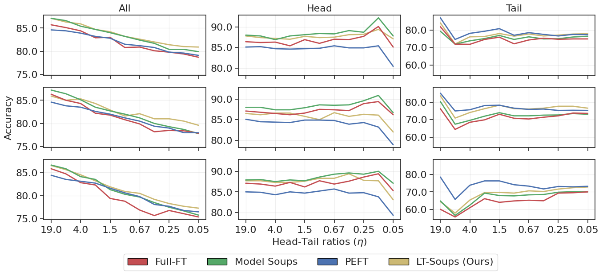
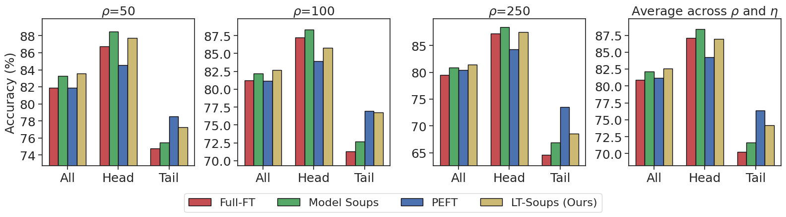

# LT-Soups: Bridging Head and Tail Classes via Subsampled Model Soups

This is the source code for the paper: [LT-Soups: Bridging Head and Tail Classes via Subsampled Model Soups](https://openreview.net/pdf?id=tiEsJtw3FH) (Neurips 2025).

## Requirements

* Python 3.10
* PyTorch 2.7
* Torchvision 0.22

- Other dependencies are listed in [requirements.txt](requirements.txt).

To install requirements, run:

```sh
conda create -n lt_soups python=3.10 -y
conda activate lt_soups
pip install torch==2.7.0 torchvision==0.22.0 --index-url https://download.pytorch.org/whl/cu126
pip install -r requirements.txt
```

## Hardware

Most experiments can be reproduced using a single GPU with 24GB of memory (larger models such as ViT-L require more memory).

## Reproduce CIFAR-100-LT benchmarks

```bash
# run Full-FT on CIFAR-100-LT across (imbalanced ratio=[50, 100, 250] and head_tail_split=[95-5])
bash scripts/run_cifar100_lt.sh
```

[](fig_1)
[](fig_1)

## Running on Large-scale Long-tailed Datasets

### Prepare the Dataset

Download the dataset [Places](http://places2.csail.mit.edu/download.html), [ImageNet](http://image-net.org/index), and [iNaturalist 2018](https://github.com/visipedia/inat_comp/tree/master/2018).

Put files in the following locations and change the path in the data configure files in [configs/data](configs/data):

- Places

```
Path/To/Dataset
├─ train
│  ├─ airfield
|  |  ├─ 00000001.jpg
|  |  └─ ......
│  └─ ......
└─ val
   ├─ airfield
   |  ├─ Places365_val_00000435.jpg
   |  └─ ......
   └─ ......
```

- ImageNet

```
Path/To/Dataset
├─ train
│  ├─ n01440764
|  |  ├─ n01440764_18.JPEG
|  |  └─ ......
│  └─ ......
└─ val
   ├─ n01440764
   |  ├─ ILSVRC2012_val_00000293.JPEG
   |  └─ ......
   └─ ......
```

- iNaturalist 2018

```
Path/To/Dataset
└─ train_val2018
   ├─ Actinopterygii
   |  ├─ 2229
   |  |  ├─ 2c5596da5091695e44b5604c2a53c477.jpg
   |  |  └─ ......
   |  └─ ......
   └─ ......
```

### Reproduction

To reproduce the LT-Soups result for CIFAR-100-LT, please run

```bash
bash scripts/run_lt_soups.sh
```

### Detailed Usage

To train and test the proposed method on more settings, run

```bash
python main.py -d [data] -m [model] [options]
```

The `[data]` can be the name of a .yaml file in [configs/data](configs/data), including `imagenet_lt`, `places_lt`, `inat2018`, `cifar100_ir100`, `cifar100_ir50`, `cifar100_ir10`, etc.

The `[model]` can be the name of a .yaml file in [configs/model](configs/model), including `clip_rn50`, `clip_vit_b16`, `in21k_vit_b16`, etc.

Note that using only `-d` and `-m` options denotes only fine-tuning the classifier. Please use additional `[options]` for more settings. 

- To train a model under specific imbalanced ratio e.g 32, add `balanced_sampling True subsample True balance_factor 32`.

- To train LT-Soups under range of imbalanced ratios, add `factors [0, 1, 2, ..]` where each factor corresponds to an imbalanced ratio as `2**factor`.

- To apply lightweight fine-tuning methods, add options like `lora True`, `adaptformer True`, etc.

- To apply test-time ensembling, add `tte True`.

Moreover, `[options]` can facilitate modifying the configure options in [utils/config.py](utils/config.py). Following are some examples.

- To specify the root path of datasets, add `root Path/To/Datasets`.

- To change the output directory, add an option like `output_dir NewExpDir`. Then the results will be saved in `output/NewExpDir`.

- To assign a single GPU (for example, GPU 0), add an option like `gpu 0`.

- To test an existing model, add `test_only True`. This option will test the model trained by your configure file. To test another model, add an additional option like `model_dir output/AnotherExpDir`.

- To test an existing model on the training set, add `test_train True`.

## Acknowledgment

We thank the authors for the following repositories for code reference:
[[LIFT]](https://github.com/shijxcs/LIFT), [[OLTR]](https://github.com/zhmiao/OpenLongTailRecognition-OLTR), [[Classifier-Balancing]](https://github.com/facebookresearch/classifier-balancing), [[Dassl]](https://github.com/KaiyangZhou/Dassl.pytorch), [[CoOp]](https://github.com/KaiyangZhou/CoOp).

## Citation

If you find this repo useful for your work, please cite as:

```bibtex
@inproceedings{
aminbeidokhti2025ltsoups,
title={{LT}-Soups: Bridging Head and Tail Classes via Subsampled Model Soups},
author={Masih Aminbeidokhti and Subhankar Roy and Eric Granger and Elisa Ricci and Marco Pedersoli},
booktitle={The Thirty-ninth Annual Conference on Neural Information Processing Systems},
year={2025},
url={https://openreview.net/forum?id=tiEsJtw3FH}
}
```
